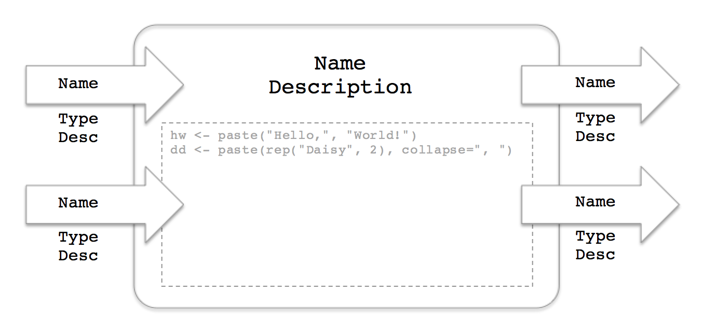

```{r setup, include=FALSE}
options(width=65)
```

## Why Geospatial Data Tasks?
> - Everyone collects geospatial data
> - Geospatial data tasks are outside the mainstream

## What Is Visual Analytics Software?
> - Spotfire, Tableau, others
> - Think: Excel on steroids

## Spotfire Has an R Engine Built In
>- TIBCO Enterprise Runtime for R (TERR)
>- Configure R scripts to run in Spotfire analysis documents
>- Apply R scripts without looking at the code

## Data Function



## Basic Geospatial Data Tasks

- Transform coordinate reference systems
- Perform spatial overlay
- Find unions, intersections, differences
- Calculate lengths, areas, perimeters
- Calculate geographic coordinates of shapes for drawing on maps

## Packages for Basic Geospatial Data Tasks

Essential packages

- [**sp**](http://cran.r-project.org/package=sp)
- [**rgdal**](http://cran.r-project.org/package=rgdal)

Other important packages

- [**geosphere**](http://cran.r-project.org/package=geosphere)
- [**rgeos**](http://cran.r-project.org/package=rgeos)
- [**maptools**](http://cran.r-project.org/package=maptools)


## Transform CRS

```{r eval=FALSE}
spTransform(
	Spatial, 
	CRS=CRS("+proj=longlat +ellps=WGS84 +datum=WGS84 +no_defs")
)
```

Returns Spatial object with coordinates transformed to the new coordinate reference system (in this example, WGS84 longitude/latitude coordinates)

## Perform Spatial Overlay

```{r eval=FALSE}
SpatialPoints %over% SpatialPolygons
```

Returns vector of indices of the polygons in which each point falls

## Try It Yourself

Spotfire software: [spotfire.tibco.com/trydesktop](http://spotfire.tibco.com/trydesktop)

Data functions: [github.com/ianmcook/useR-2015](https://github.com/ianmcook/useR-2015)
